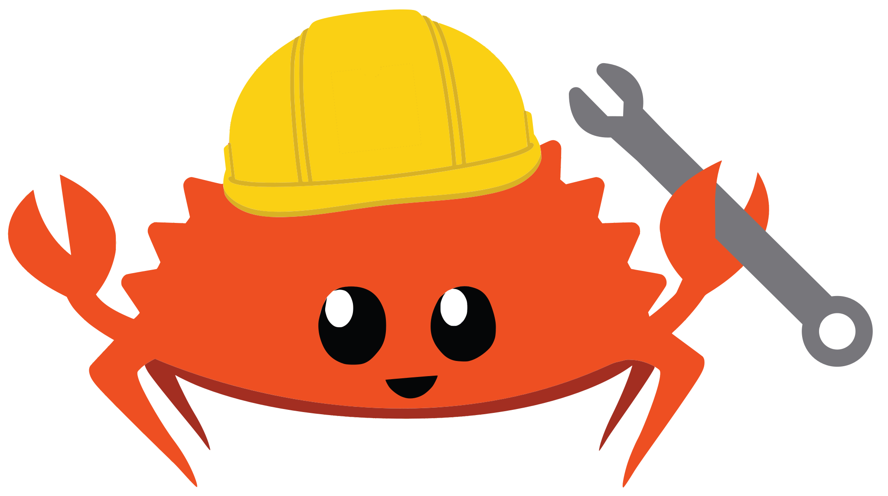

</img>

<h2 align="center">Ferride</h2>

A Simple, Cross Platform IDE for Rust.

<i>The Welcome Window</i>

## Contributions
If you find this project interesting and want to contribute, pull requests and issues are greatly appreciated, I'm trying to make this as fast and efficient as possible.

## Planned Core Features (Work in Progress To-Do List)
- [ ] Customizable GTK Interface (Want it to look more legacy, menu bar, etc, no GNOME headerbar type thing so we can use it more natively on Windows and Macos (ew)).
- [ ] Sections for a terminal, text editor, file manager, and a file overview (structs, functions, traits, enums, etc).
- [ ] Integrated terminal based on Alacritty (Create our own alacritty-gobject then have easy settings in our applicaiton preferences window).
- [ ] Integrated cargo project preferences into our window so things like name and description can be set from the GUI menu.
- [ ] Connect to crates.io API so developers can search crates.io from within ferride to search and add new dependencies easier.
- [ ] Integrated Rust Language completion in GtkSourceView from the rust-analyzer Rust API.
- [ ] Configuration files in users $HOME for remembering settings as well as project directories.
- [ ] Integration with Cargo and Cargo subcommands so ferride has buttons for running, building, and testing examples, targets, and tests.
- [ ] Allow cloning git repositories and then super simple "add, commit, push" system.

## Some More frivolous Features We Might Want to Add
- [ ] Custom GTK stylesheets for themes like solarized and monokai like VSCode. (contrary to https://stopthemingmy.app/?)
- [X] Our own little ferris icon, make it super cute with a hard hat and a hammer or something :)
- [ ] Use github and gitlab API to allow user to search up a repository before cloning it.
- [ ] Link to gitoxide instead of git because gitoxide is written in pure rust meaning that the user won't have to have libgit (gix is still under development)
