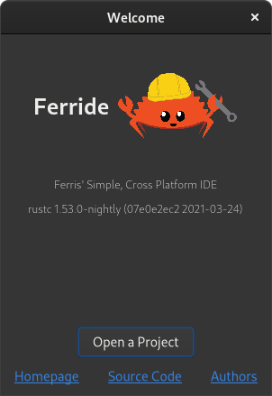

*Ferride is not even near working*

</img>

<h2 align="center">Ferride</h2>

A Simple, Cross Platform IDE for Rust.

<i>The Welcome Window</i>

## Contributions
If you find this project interesting and want to contribute, pull requests and issues are greatly appreciated, I'm trying to make this as fast and efficient as possible.

Just pick one from below :)

## Roadmap
- [X] Write simple greeter/welcome window.
- [X] Layout project structure and functions for getting Cargo project data.
- [ ] Setup main project window with functions for each panel and structs (subclassing? no/yes) for UI sections.
- [ ] Sections for a terminal, text editor, file manager.
  - [ ] Terminal - [alacritty](https://github.com/alacritty/alacritty)
    - [ ] [alacritty-gobject](https://github.com/grantshandy/alacritty-gobject) - Grant
      - [ ] [gtk-glutin](https://github.com/grantshandy/gtk-glutin) - Grant
  - [ ] Text editor.
    - [ ] [sourceview5-rs](https://gitlab.gnome.org/World/Rust/sourceview5-rs)
    - [ ] [rust-analyzer](https://github.com/rust-analyzer/rust-analyzer/tree/master/crates/ide) ide crate. (how should we get this?).
  - [ ] File manager.
- [ ] Integration with Cargo so our run button can run multiple targets, build multiple target, and run different tests all from a drop down menu.
- [ ] Create config file for ferride in our users home directory.
  - [ ] [dirs](https://crates.io/crates/dirs)
  - [ ] [serde-yaml](https://crates.io/crates/serde_yaml)
- [ ] System preferences that integrate settings between the terminal, text editor, and file manager.
- [ ] Project preferences window that edit `Cargo.toml` directly (name, version, description, categories, keywords, etc...).
- [ ] Manage `crates.io` dependencies in `Cargo.toml` from project preferences (search, add, edit, delete, etc...).
  - [ ] [crates-io](https://crates.io/crates/crates-io)
- [ ] Allow managing git repositories (clone, fetch, pull, commit, push)
  - [ ] [git2](https://crates.io/crates/git2)
  - [ ] [gitoxide](https://github.com/Byron/gitoxide)
- [ ] Preview `.svg` and `.png`/`.jpg` images directly in the editor.
- [ ] Preview `.html` and `.md` files directly in the editor with live updates.
  - [ ] [webkit2gtk](https://crates.io/crates/webkit2gtk)
  - [ ] [markdown](https://crates.io/crates/markdown)
- [ ] Set custom GTK stylesheet themes like solarized and monokai in the preferences window (syncs GTK and alacritty).
- [ ] Use github/gitlab API to search up git repos in a search dialog.
  - [ ] [github](https://crates.io/crates/github)
  - [ ] [gitlab](https://crates.io/crates/gitlab)
- [ ] Build and view documentation for all our cargo dependencies directly, then view in the editor using [webkit2gtk](https://crates.io/crates/webkit2gtk).
